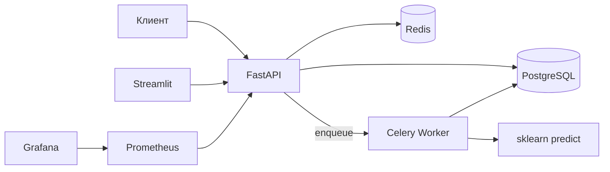

# ML Prediction Service

**Асинхронный inference scikit-learn с биллингом по кредитам и программой лояльности.**

> **EN:** FastAPI + PostgreSQL + Redis/Celery stack: JWT auth, credit billing with idempotent charges, async prediction jobs, Bronze/Silver/Gold loyalty tiers with monthly recalculation, Streamlit analytics, Prometheus/Grafana.

---

## Возможности

| Область | Описание |
|--------|----------|
| **API** | FastAPI, OpenAPI/Swagger на `/docs`, healthcheck `/health` |
| **Аутентификация** | JWT (OAuth2 password), роли `user` и `admin` |
| **ML** | Загрузка моделей `.pkl` / `.joblib`, валидация `predict()`, очередь Celery, статусы задач и polling по `job_id` |
| **Биллинг** | Баланс кредитов, история транзакций, заглушка платёжного callback (HMAC), атомарное списание после успешного inference |
| **Лояльность** | Уровни и скидки в БД, ежемесячный пересчёт (Celery Beat, 1-е число) по успешным предсказаниям за прошлый месяц |
| **Дашборд** | Streamlit: вход через тот же API, сводка по аккаунту |
| **Наблюдаемость** | Метрики `/metrics` (Starlette Prometheus + кастомные счётчики), Grafana с provisioning |

Подробнее о деньгах и отказоустойчивости: [`docs/billing.md`](docs/billing.md). Краткий бизнес-контекст: [`docs/business_plan.md`](docs/business_plan.md).

---

## Быстрый старт (Docker)

Требования: **Docker** и **Docker Compose v2**.

```bash
git clone https://github.com/<USER>/<REPO>.git
cd <REPO>   # или "ML Services", если репозиторий так назван
cp .env.example .env   # при необходимости поправьте значения
docker compose up -d --build
```

После старта (миграции Alembic выполняются при запуске `api`):

| Сервис | URL / порт |
|--------|------------|
| Swagger UI | [http://localhost:8000/docs](http://localhost:8000/docs) |
| Health | [http://localhost:8000/health](http://localhost:8000/health) |
| Streamlit | [http://localhost:8502](http://localhost:8502) *(хост **8502** → контейнер 8501; при конфликте порта с другим проектом можно изменить в `docker-compose.yml`)* |
| Prometheus | [http://localhost:9090](http://localhost:9090) |
| Grafana | [http://localhost:3000](http://localhost:3000) (по умолчанию `admin` / `admin`) |

Проверка контейнеров: `docker compose ps`. Логи API: `docker compose logs -f api`.

Первый сценарий в Swagger: **регистрация** → **получение токена** → **Authorize** → `GET /users/me`, `GET /billing/balance`. Для успешных предсказаний должен быть запущен **worker**.

---

## Переменные окружения

Секреты и URL задаются через окружение (см. [`.env.example`](.env.example)). В Docker Compose для Postgres/Redis часть значений уже задана в `environment` сервисов.

| Переменная | Назначение |
|------------|------------|
| `DATABASE_URL_SYNC` | PostgreSQL (sync driver для SQLAlchemy 2) |
| `REDIS_URL` | Redis для Celery |
| `SECRET_KEY` | Подпись JWT (в продакшене — длинная случайная строка) |
| `PAYMENT_WEBHOOK_SECRET` | Секрет HMAC для заглушки платежа |
| `PREDICTION_BASE_COST_CREDITS` | Базовая цена предсказания (дублируется/перекрывается `billing_config` в БД) |
| `MODEL_STORAGE_PATH` | Каталог файлов загруженных моделей |

---

## Локальная разработка и тесты

```bash
python3 -m venv .venv
source .venv/bin/activate  # Windows: .venv\Scripts\activate
pip install -r requirements.txt
```

Нужны локально запущенные **PostgreSQL** и **Redis**, переменные как в `.env.example`. Затем:

```bash
alembic upgrade head
uvicorn app.main:app --reload --host 0.0.0.0 --port 8000
```

Тесты и покрытие (порог задаётся в `pytest.ini`):

```bash
pytest
```

---

## Структура репозитория

```
app/                 # FastAPI: роуты, модели SQLAlchemy, схемы, сервисы
worker/              # Celery: predict + ежемесячный пересчёт лояльности
streamlit_app/       # Дашборд Streamlit
alembic/             # Миграции БД
tests/               # Pytest (биллинг, JWT, воркер, API)
docs/                # billing.md, business_plan.md
grafana/             # Provisioning и JSON дашборда
prometheus.yml       # scrape_configs для API
docker-compose.yml
Dockerfile
Dockerfile.streamlit
```

---

## Архитектура


